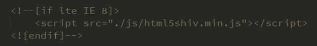
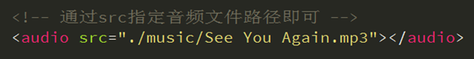
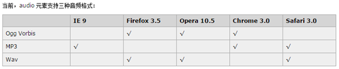
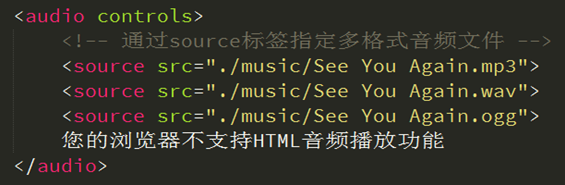
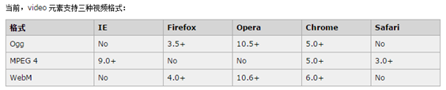
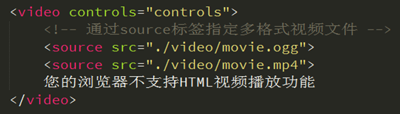

## 1. 前言

### 1.1 认识HTML5

HTML5并不仅仅只是作为HTML标记语言的一个最新版本，更重要的是它制定了Web应用开发的一系列标准，成为第一个将Web做为应用开发平台的HTML语言。

HTML5定义了一系列新元素，如新语义标签、智能表单、多媒体标签等，可以帮助开发者创建富互联网应用，还提供了一系列Javascript API，如地理定位、重力感应、硬件访问等，可以在浏览器内实现类原生应用，甚至结合Canvas我们可开发网页版游戏，同时结合CSS3的过渡、转换、动画等特性，可以极大的增强用户体验，提升开发功能的可应用性。

我们日常讨论的H5其实是一个泛称，它指的是由HTML5 + CSS3 + Javascript等技术组合而成的一个应用开发平台。

### 1.2 语法规范

随着Web技术的更新，HTML也先后经历了HTML4.01、XHTML 1.0、HTML5几个重要的版本，在版本的演变过程中新增或废弃了一些属性，同时对语法规范也做了一些调整，为了能够保证浏览器可以兼容不同版本语法规范的，我们可以使用&lt;!DOCTYPE>指示浏览器应该如何处理我们的HTML。

```html
<!DOCTYPE html>
<html lang="en">
<head>
	<meta charset="UTF-8">
	<title>Document</title>
</head>
<body>
	
</body>
</html>
```

HTML5在语法规范上也做了比较大的调整，去除了许多冗余的内容，书写规则更加简洁、清晰。

```html
<!DOCTYPE html>
<html lang="en">
<head>
	<meta charset="UTF-8">
	<title>Document</title>
</head>
<body>
	<P><div></p></div>
</body>
</html>
```

通过以上的比较我们可以总结得出HTML5在语法规范上的特点：更简洁，更宽松

但是我们在实际开发中应规范书写，不建议太随意 ！并且现在基本所有网站都采用了HTML5的语法规范。

[W3C验证地址](https://validator.w3.org/)

## 2. 语义化

所谓语义化是要使HTML标签具备很好的可读性，可以清晰传达每个标签所要表达的意义，以方便其被友好的处理和解析。

### 语义化标签

对于语义化标签我们并不陌生，如&lt;p>表示一个段落、&lt;ul>表示一个无序列表&lt;h1> ~ &lt;h6>表示一系列标题等，在此基础上HTML5增加了大量更有意义的语义标签，更有利于搜索引擎或辅助设备来理解HTML页面内容。

传统的做法我们通过添加类名如class="header"、class="footer"，使HTML页面具有语义性的，但是不具有通用性（如class="header"也可能被写成class="head"）。

```html
<!DOCTYPE html PUBLIC "-//W3C//DTD XHTML 1.0 Transitional//EN" "http://www.w3.org/TR/xhtml1/DTD/xhtml1-transitional.dtd">
<html xmlns="http://www.w3.org/1999/xhtml" xml:lang="en">
<head>
	<meta http-equiv="Content-Type" content="text/html;charset=UTF-8">
	<title>传统语义处理</title>
	<style>
		body {
			padding: 0;
			margin: 0;
			background-color: #F7F7F7;
		}

		.header {
			height: 60px;
			text-align: center;
			line-height: 60px;
			background-color: blue;
		}

		.container {
			width: 1000px;
			height: 600px;
			margin: 0 auto;
		}

		.container .article {
			width: 750px;
			height: 100%;
			background-color: green;
			float: left;
		}

		.container .aside {
			width: 250px;
			height: 100%;
			background-color: yellow;
			float: left;
		}

		.footer {
			height: 120px;
			background-color: pink;
		}
	</style>
</head>
<body>
	<!-- 头部 -->
	<div class="header">头部</div>
	<!-- 主体部分 -->
	<div class="container">
		<div class="article"></div>
		<div class="aside"></div>
	</div>
	<!-- 底部 -->
	<div class="footer"></div>
</body>
</html>
```

HTML5则是通过增加语义化标签的形式来解决这个问题，例如&lt;header>&lt;/header>、&lt;footer>&lt;/footer>等，这样就可以保证其具有通用性。

```html
<!DOCTYPE html>
<html lang="en">
<head>
	<meta charset="UTF-8">
	<title>HTML5语义标签</title>
	<style>
		body {
			padding: 0;
			margin: 0;
			background-color: #F7F7F7;
		}

		header {
			height: 60px;
			text-align: center;
			line-height: 60px;
			background-color: blue;
		}

		.container {
			width: 1000px;
			height: 600px;
			margin: 0 auto;
		}

		.container article {
			width: 750px;
			height: 100%;
			background-color: green;
			float: left;
		}

		.container aside {
			width: 250px;
			height: 100%;
			background-color: yellow;
			float: left;
		}

		footer {
			height: 120px;
			background-color: pink;
		}
	</style>
</head>
<body>
	<header>头部</header>
	<section class="container">
		<article></article>
		<aside></aside>
	</section>
	<footer></footer>
</body>
</html>
```

此章节学习目的为了解增加语义标签的目的，以及各语义标签所表达的意义，在网页布局中能够合理使用标签。

### 常用语义标签

| 标签            | 语义   |
| :------------ | :--- |
| &lt;nav>      | 导航   |
| &lt;header>   | 页眉   |
| &lt;footer>   | 页脚   |
| &lt;section>  | 区块   |
| &lt;article>  | 文章   |
| &lt;aside>    | 侧边栏  |
| &lt;progress> | 进度条  |

```html
<!DOCTYPE html>
<html lang="en">
<head>
	<meta charset="UTF-8">
	<title>Document</title>
	<style>
		header {
			height: 100px;
			width: 980px;
			margin: 0 auto;
			border: 1px solid #CCC;
		}
		nav {
			background-color: red;
		}

		section {
			height: 600px;
			width: 980px;
			margin: 0 auto;
			background-color: pink;
		}

		article {
			width: 800px;
			height: 100%;
			float: left;
			background-color: blue;
		}

		aside {
			width: 180px;
			height: 100%;
			float: right;
		}

		footer {
			text-align: center;
		}

		progress {
			height: 100px;

			background-color: #FFF;

			/*border: 0 none;*/
			border-radius: 5px solid red;
		}
	</style>
</head>
<body>
	<!-- 使用方法跟普通标签一样，只是体现语义 -->
	<header>
		<nav>
			<a href="#">首页</a>
			<a href="#">新闻</a>
			<a href="#">资讯</a>
		</nav>
	</header>
	<section class="container">
		<article>
			主体文章
			<progress min="0" max="100" value="50"></progress>
		</article>
		<aside>
			<a href="">其它的文章</a>
			<a href="">其它的文章</a>
			<a href="">其它的文章</a>
			<a href="">其它的文章</a>
			<a href="">其它的文章</a>
			<a href="">其它的文章</a>
			<a href="">其它的文章</a>
			<a href="">其它的文章</a>
			<a href="">其它的文章</a>
			<a href="">其它的文章</a>
			<a href="">其它的文章</a>
			<a href="">其它的文章</a>
		</aside>
	</section>
	<footer>
		<p>版权所有传智播客</p>
	</footer>
</body>
</html>
```

本质上新语义标签与<div>、<span>没有区别，只是其具有语义性，使用时除了在HTML结构上需要注意外，其它和普通标签的使用无任何差别，可以理解成<divclass="nav"> 相当于 <nav>。不要好奇，它只是一个标签！

尽量避免全局使用header、footer、aside等语义标签。

### 兼容处理

在不支持HTML5新标签的浏览器里，会将这些新的标签解析成行内元素(inline)对待，所以我们只需要将其转换成块元素(block)即可使用，但是在IE9版本以下，并不能正常解析这些新标签，但是却可以识别通过`document.createElement('tagName')`创建的自定义标签，于是我们的解决方案就是将HTML5的新标签全部通过`document.createElement('tagName')`来创建一遍，这样IE低版本也能正常解析HTML5新标签了，但在实际开发中我们更多采用的是通过检测IE浏览器的版本来加载第三方的一个JS库来解决兼容问题，这个库文件会帮自动通过`document.createElement('tagName')`创建所有HTML5的新标签。



```html
<!DOCTYPE html>
<html lang="en">
<head>
	<meta charset="UTF-8">
	<title>Document</title>
	<style>
		header {
			/*display: block;*/
			width: 980px;
			height: 100px;
			margin: 0 auto;
			background-color: red;
		}

		footer {
			/*display: block;*/
			width: 980px;
			height: 80px;
			margin: 0 auto;
			background-color: blue;
		}
	</style>
	
	<!--[if lte IE 8]>
		<script>
			alert(1)
		</script>
		<script src="./js/html5shiv.min.js"></script>
	<![endif]-->

	<script>
		// document.createElement('div');
		// document.createElement('header');
		// document.createElement('itcast');
	</script>
</head>
<body>
	<header></header>
	<footer></footer>

	&lt; less than
	&gt; great than 

	equal
</body>
</html>
```

### 微数据

微数据是在如 span、div 的标签内添加属性，让机器（如搜索引擎）识别其含义，某些特定类型的信息，例如评论、人物信息或事件都有相应的属性，用来描述其含义，可以理解成新语义标签的一种补充。

```html
<!DOCTYPE html>
<html lang="en">
<head>
	<meta charset="UTF-8">
	<title>微数据</title>
</head>
<body>
	<!-- 传统做法 -->
	<!-- <div>
		<span>Kayo</span>
		<span>2012年2月6日 22:30</span>
		<span>评论内容</span>
	</div> -->
	
	<!-- 友好做法，可以让机器也能识别内容 -->
	<div itemscope itemtype="http://schema.org/Movie">
		<span itemprop="actor">刘德华</span>
		<span itemprop="director" datatime="2012-02-06T22:30:30.50+08:00">2012年2月6日 22:30</span>
		<a href="" itemprop="url"></a>
		<p itemprop="url" >http://www.baidu.com</p>
		<span itemprop="description">评论内容</span>
	</div>
</body>
</html>
```

[HTML5扩展之微数据与丰富网页摘要](http://www.zhangxinxu.com/wordpress/2011/12/html5%E6%89%A9%E5%B1%95-%E5%BE%AE%E6%95%B0%E6%8D%AE-%E4%B8%B0%E5%AF%8C%E7%BD%91%E9%A1%B5%E6%91%98%E8%A6%81/)

### WAI-ARIA

WAI-ARIA[1][ ]() , 是WebAccessibility Initiative - Accessible Rich Internet Applications 的缩写，它主要解决的一个问题：让残障人士能无障碍地访问网页上的动态内容。

[WAI-ARIA无障碍网页应用属性完全展示](http://www.zhangxinxu.com/wordpress/2012/03/wai-aria-%E6%97%A0%E9%9A%9C%E7%A2%8D%E9%98%85%E8%AF%BB/)

### 表单

伴随着互联网富应用以及移动开发的兴起，传统的Web表单已经越来越不能满足开发的需求，所以HTML5在Web表单方向也做了很大的改进，如拾色器、日期/时间组件等，使表单处理变的更加高效。

### 输入类型

| 类型       | 使用示例                       | 含义         |
| -------- | -------------------------- | ---------- |
| email    | &lt;input type="email">    | 输入邮箱格式     |
| tel      | &lt;input type="tel">      | 输入手机号码格式   |
| url      | &lt;input type="url">      | 输入url格式    |
| number   | &lt;input type="number">   | 输入数字格式     |
| search   | &lt;input type="search">   | 搜索框（体现语义化） |
| range    | &lt;input type="range">    | 自由拖动滑块     |
| color    | &lt;input type="color">    | 拾色器        |
| time     | &lt;input type="time">     | 时间         |
| date     | &lt;input type="date">     | 日期         |
| datetime | &lt;input type="datetime"> |            |
| month    | &lt;input type="month">    | 月份         |
| week     | &lt;input type="week">     | 星期         |

```html
<!DOCTYPE html>
<html lang="en">
<head>
	<meta charset="UTF-8">
	<title>表单类型</title>
	<style>
		body {
			height: 2000px;
			margin: 0;
			padding: 0;
			background-color: #F7F7F7;
		}

		form {
			max-width: 640px;
			width: 100%;
			margin: 32px auto 0;
			font-size: 32px;
		}

		label {
			display: block;
			margin: 30px 0;
		}

		input {
			width: 100%;
			height: 32px;
			margin-top: 10px;
			display: block;
		}

	</style>
</head>
<body>
	<!-- <input type="text">
	<input type="password">
	<input type="radio">
	<input type="checkbox">
	<input type="file">
	<input type="button">
	<input type="submit">
	<input type="reset"> -->
	<form action="">
		<fieldset>
			<legend>输入类型</legend>
			<label for="demo">
				email: <input type="email" id="demo">
			</label>
			<label for="">
				tel: <input type="tel">
			</label>
			<label for="">
				url: <input type="url">
			</label>
			<label for="">
				number: <input type="number" step="4" min="8" max="16">
			</label>
			<label for="">
				search: <input type="search">
			</label>
			<label for="">
				range: <input type="range" value="0">
			</label>
			<label for="">
				color: <input type="color">
			</label>
			<label for="">
				time: <input type="time">
			</label>
			<label for="">
				date: <input type="date">
			</label>
			<label for="">
				datetime: <input type="datetime">
			</label>
			<label for="">
				month: <input type="month">
			</label>
			<label for="">
				week: <input type="week">
			</label>
			<label for="">
				<input type="submit" value="提交">
			</label>
		</fieldset>
	</form>
</body>
</html>
```

部分类型是针对移动设备生效的，且具有一定的兼容性，在实际应用当中应选择性的使用，扫描二维码可以对比测试。

### 表单元素

| 元素            | 含义      |
| ------------- | ------- |
| &lt;datalist> | 数据列表    |
| &lt;keygen>   | 生成加密字符串 |
| &lt;output>   | 输出结果    |
| &lt;meter>    | 度量器     |

```html
<!DOCTYPE html>
<html lang="en">
<head>
	<meta charset="UTF-8">
	<title>表单元素</title>
	<style>
		body {
			height: 1000px;
			margin: 0;
			padding: 0;
			background-color: #F7F7F7;
		}

		form {
			max-width: 640px;
			width: 100%;
			margin: 32px auto 0;
			font-size: 32px;
		}

		label {
			display: block;
			margin: 30px;
		}

		input {
			display: block;
			width: 100%;
			height: 32px;
			margin-top: 10px;
		}

		textarea {
			display: block;
		}
	</style>
</head>
<body>
	<form action="">
		<label for="">
			姓名：<input type="text" name="name">
		</label>
		<label for="">
			省份：<select name="area" id="">
				<option value="1">河北省</option>
				<option value="2">山西省</option>
				<option value="3">山东省</option>
			</select>
		</label>
		<label for="">
			个人简介：<textarea name="" id="" cols="30" rows="10"></textarea>
		</label>
		<label for="">
			课程：<input type="text" list="course">
		</label>
		<datalist id="course">
			<option value="php1"></option>
			<option value="python"></option>
			<option value="photoshop"></option>
			<option value="java"></option>
			<option value="javascrit"></option>
			<option value="front end"></option>
			<option value="写代码"></option>
		</datalist>
		<label for="">
			加密类型：<keygen name="anquan">
		</label>
		<label for="">
			结果：<output>一些结果</output>
		</label>
		<label for="">
			度量器：<meter min="0" max="100" low="60" high="80" value="50"></meter>
			度量器：<meter min="0" max="100" low="60" high="80" value="70"></meter>
			度量器：<meter min="0" max="100" low="60" high="80" value="90"></meter>
		</label>
		<label for="">
			<input type="submit" value="保存">
		</label>
	</form>
</body>
</html>
```

### 表单属性

| 属性           | 用法                                       | 含义     |
| ------------ | ---------------------------------------- | ------ |
| placeholder  | &lt;input type="text" placeholder="请输入用户名"> | 占位符    |
| autofocus    | &lt;input type="text" autofocus>         | 自动获得焦点 |
| multiple     | &lt;input type="file" multiple>          | 多文件上传  |
| autocomplete | &lt;input type="text"  autocomplete="off"> | 自动完成   |
| form         | &lt;input type="text" form="某表单ID">      |        |
| novalidate   | &lt;form novalidate>&lt;/form>           | 关闭验证   |
| required     | &lt;input type="text" required>          | 必填项    |
| pattern      | &lt;input type="text"  pattern="\d">     | 自定义验证  |

```html
<!DOCTYPE html>
<html lang="en">
<head>
	<meta charset="UTF-8">
	<title>表单属性</title>
	<style>
		body {
			margin: 0;
			padding: 0;
			background-color: #F7F7F7;
		}

		form {
			max-width: 640px;
			width: 100%;
			margin: 32px auto 0;
			font-size: 32px;
		}

		label {
			display: block;
			margin: 30px;
		}

		input {
			display: block;
			width: 100%;
			height: 32px;
			margin-top: 10px;
		}
	</style>
</head>
<body>
	<!-- <form action="" autocomplete="off" novalidate id="myForm"> -->
	<form action="" autocomplete="off" id="myForm">
		<fieldset>
			<legend>表单属性</legend>
			<label for="">
				placeholder: <input type="text" name="placeholder" placeholder="请输入用户名">
			</label>
			<label for="">
				autofocus: <input type="text" name="autofocus" autofocus>
			</label>
			<label for="">
				<input type="file" multiple>
			</label>
			<label for="">
				autocomplete: <input type="text" name="autocomplete" autocomplete="on">
			</label>
			<label for="">
				<!-- email: <input type="email" required> -->
			</label>
			<label for="">
				<!-- text: <input type="text" required> -->
			</label>
			<label for="">
				pattern: <input type="text" pattern="\D+">
			</label>
			<label for="">
				<input type="submit" value="保存">
			</label>
		</fieldset>
	</form>
	<div class="">
		<p>adsfasdfasdfasdf</p>
		<p>adsfasdfasdfasdf</p>
		<p>adsfasdfasdfasdf</p>
		<p>adsfasdfasdfasdf</p>
		<p>adsfasdfasdfasdf</p>
		<p>adsfasdfasdfasdf</p>
		<p>adsfasdfasdfasdf</p>
		<p>adsfasdfasdfasdf</p>
		<p>adsfasdfasdfasdf</p>
		<p>adsfasdfasdfasdf</p>
		<p>adsfasdfasdfasdf</p>
		<p>adsfasdfasdfasdf</p>
		<p>adsfasdfasdfasdf</p>
		<p>adsfasdfasdfasdf</p>
		<p>adsfasdfasdfasdf</p>
	</div>
	<input type="text" name="demo" form="myForm">
</body>
</html>
```

## 3. 多媒体

在HTML5之前，在网页上播放音频/视频的通用方法是利用Flash来播放，但是大多情况下，并非所有用户的浏览器都安装了Flash插件，由此使得处理音频/视频播放变的非常复杂，并且移动设备的浏览器并不支持Flash插件。

### 音频

HTML5通过<audio>标签来解决音频播放的问题。使用相当简单，如下图所示

 

并且可以通过附加属性可以更友好控制音频的播放，如：

- autoplay 自动播放
- controls 是否显不默认播放控件
- loop 循环播放

由于版权等原因，不同的浏览器可支持播放的格式是不一样的，如下图供参考

 

多浏览器支持的方案，如下图

 

```html
<!DOCTYPE html>
<html lang="en">
<head>
	<meta charset="UTF-8">
	<title>HTML5 API 音频</title>
</head>
<body>
	
	<!-- html也提供了一个标签来播放音乐 -->

	<!-- <audio src="./music/See You Again.mp3" controls autoplay loop="3"></audio>	
	<audio src="./music/See You Again.wav" controls autoplay loop="3"></audio>	
	<audio src="./music/See You Again.ogg" controls autoplay loop="3"></audio>	 -->

	<audio controls>
		<source src="./music/See You Again.mp3">
		<source src="./music/See You Again.wav">
		<source src="./music/See You Again.ogg">
		浏览器不支持HTML5音频播放
	</audio>

</body>
</html>
```

### 视频

HTML5通过<video>标签来解决音频播放的问题。同音频播放一样，<video>使用也相当简单，如下图

 

同样，通过附加属性可以更友好的控制视频的播放

- autoplay 自动播放
- controls 是否显示默认播放控件
- loop 循环播放
- width 设置播放窗口宽度
- height 设置播放窗口的高度

由于版权等原因，不同的浏览器可支持播放的格式是不一样的，如下图供参考

 

多浏览器支持的方案，如下图

 

```html
<!DOCTYPE html>
<html lang="en">
<head>
	<meta charset="UTF-8">
	<title>HTML5 API 视频</title>
</head>
<body>

	<!-- html提供了一个播视频的标签 -->
	<video src="./video/movie.mp4" width="800" controls autoplay loop="3"></video>

	<!--  -->

	<video src="" controls>
		<source src="./video/movie.mp4">
		<source src="./video/movie.ogg">
		浏览器不支持HTML5视频播放
	</video>
</body>
</html>
```

## 4. DOM扩展

### 获取元素

document.getElementsByClassName ('class')通过类名获取元素，以伪数组形式存在。

```html
<!DOCTYPE html>
<html lang="en">
<head>
	<meta charset="UTF-8">
	<title>获取元素</title>
	<style>
		.active {
			color: red;
		}
	</style>
</head>
<body>
	<ul>
		<li>国内新闻</li>
		<li class="active">国际新闻</li>
		<li class="active">体育新闻</li>
		<li>娱乐新闻</li>
	</ul>
	<script>
		// document.getElementById();
		// document.getElementsByTagName(); 伪数组

		// 以前是可以获取元素的，但是获取的条件比较单一

		// HTML5 提供了一些新的DOM获取元素的方法
		// document.getElementsByClassName(); 伪数组

		var active = document.getElementsByClassName('active');

		console.log(active);

		active[0].style.backgroundColor = 'red';

		active[1].style.backgroundColor = 'blue';


	</script>
</body>
</html>
```

document.querySelector('selector') 通过CSS选择器获取元素，符合匹配条件的第1个元素。

```html
<!DOCTYPE html>
<html lang="en">
<head>
	<meta charset="UTF-8">
	<title>获取元素</title>
	<style>
		li {}
		.first {}
		#second {}

		.first:first-child a {

		}
	</style>
</head>
<body>
	<ul>
		<li class="first"><a href="">国内新闻1 <a href="">dsfasd</a></a></li>
		<li class="first"><a href="">国内新闻2</a></li>
		<li id="second">国际新闻</li>
		<li>体育新闻</li>
		<li>娱乐新闻</li>
	</ul>
	<script>

		// HTML5还提供了更加灵活的获取方式

		// doucment.querySelector(); 
		// 通过CSS选择器来获取元素
		// 标签、类、ID、后代、子代....

		
		// 获取到是符合条件（选择器）的第一个元素

		// var lis = document.querySelector('.first');
		// var lis = document.querySelector('#second');

		var lis = document.querySelector('.first > a');

		lis.style.color = 'red';

		console.log(lis);

	</script>
</body>
</html>
```

document.querySelectorAll('selector')通过CSS选择器获取元素，以伪数组形式存在。

```html
<!DOCTYPE html>
<html lang="en">
<head>
	<meta charset="UTF-8">
	<title>获取元素</title>
	<style>
		li li {

		}
	</style>
</head>
<body>
	<ul class="outer">
		<li id="">
			国内新闻
			<ul>
				<li>北京新闻</li>
				<li>天津新闻</li>
			</ul>
		</li>
		<li>国际新闻</li>
		<li>体育新闻</li>
		<li>娱乐新闻</li>
	</ul>

	<script>

		// HTML5还提供了一个新方法
		// 更加灵活

		// document.querySelectorAll(); 伪数组

		// var lis = document.querySelectorAll('li');
		// var lis = document.querySelectorAll('li li');

		// console.log(lis.length);

		for(var i=0; i<lis.length; i++) {
			lis[i].style.color = 'red';
		}

	</script>
</body>
</html>
```

### 类名操作

- Node.classList.add('class') 添加class
- Node.classList.remove('class') 移除class
- Node.classList.toggle('class') 切换class，有则移除，无则添加
- Node.classList.contains('class') 检测是否存在class

Node指一个有效的DOM节点，是一个通称。

```html
<!DOCTYPE html>
<html lang="en">
<head>
    <meta charset="UTF-8">
    <title>Tab 标签</title>
    <style>
		body {
			margin: 0;
			padding: 0;
			background-color: #F7F7F7;
		}
	
		.tabs {
			width: 400px;
			margin: 30px auto;
			background-color: #FFF;
			border: 1px solid #C0DCC0;
			/*CSS3 新属性*/
			/*max-width: 640px; width: 100%;*/
			box-sizing: border-box;
		}

		.tabs nav {
			height: 40px;
			text-align: center;
			line-height: 40px;
			overflow: hidden;
			background-color: #C0DCC0;
			/*CSS3 新属性*/
			display: flex;
		}

		nav a {
			display: block;
			width: 100px;
			border-right: 1px solid #FFF;
			color: #000;
			text-decoration: none;
		}

		nav a:last-child {
			border-right: 0 none;
		}

		nav a.active {
			background-color: #9BAF9B;
		}

		.cont {
			overflow: hidden;
			display: none;
		}

		.cont ol {
			line-height: 30px;
		}

    </style>
</head>
<body>
	<div class="tabs">
		<nav>
			<a href="javascript:;">国内新闻</a>
			<a href="javascript:;" class="active">国际新闻</a>
			<a href="javascript:;">体育新闻</a>
			<a href="javascript:;">娱乐新闻</a>
		</nav>
    </div>
    <script>
    
    	// jQuery中 addClass() removeClass() hasClass() toggleClass()

    	// 加载jQuery 是需要时间的

    	// HTML5提供了“类似jQuery”中操作类名的方法

    	// Node.classList.add() // 添加一个类名
    	// Node.classList.remove() // 删除一个类名
    	// Node.classList.contains() // 检测是否存在一个类名
    	// Node.classList.toggle() // 切换一个类名(有则删除，无则添加)
    	// Node指的是一个DOM节点

    	// 绑订click事件
    	var navs = document.querySelectorAll('nav a'); // 伪数组

    	for(var i=0; i<navs.length; i++) {

    		// 绑订事件
    		navs[i].onclick = function () {

    			var active = document.querySelector('.active');
    			// 移除一个类名
    			// active.classList.remove('active');
    			// $('.active').removeClass('active');

    			// 添加一个类名
    			// this.classList.add('active');
    			// 相当于下面写法
    			// $(this).addClass('active');

    			// 切换类名
    			this.classList.toggle('active');
    			// $(this).toggleClass('active');

    			// 检测是否包含一个类名
    			alert(this.classList.contains('active'));
    			// $(this).hasClass('active');
    		}
    	}
	</script>
</body>
</htm
```

### 自定义属性

在HTML5中我们可以自定义属性，其格式如下data-=""，例如

data-info="我是自定义属性"，通过Node.dataset['info']我们便可以获取到自定义的属性值。

Node.dataset是以对象形式存在的，当我们为同一个DOM节点指定了多个自定义属性时，Node.dataset则存储了所有的自定义属性的值。

假设某元素 &lt;div id="demo"data-name="itcast" data-age="10">

var demo = document.querySelector('#demo');

- 读取demo.dataset['name'] 或者 demo.dataset['age']

- 设置demo.dataset['name']= 'web developer'

```html
<!DOCTYPE html>
<html lang="en">
<head>
    <meta charset="UTF-8">
    <title>Tab 标签</title>
    <style>
		body {
			margin: 0;
			padding: 0;
			background-color: #F7F7F7;
		}
	
		.tabs {
			width: 400px;
			margin: 30px auto;
			background-color: #FFF;
			border: 1px solid #C0DCC0;
			box-sizing: border-box;
		}

		.tabs nav {
			height: 40px;
			text-align: center;
			line-height: 40px;
			overflow: hidden;
			background-color: #C0DCC0;
			display: flex;
		}

		nav a {
			display: block;
			width: 100px;
			border-right: 1px solid #FFF;
			color: #000;
			text-decoration: none;
		}

		nav a:last-child {
			border-right: 0 none;
		}

		nav a.active {
			background-color: #9BAF9B;
		}

		.cont {
			overflow: hidden;
			display: none;
		}

		.cont ol {
			line-height: 30px;
		}

    </style>
</head>
<body>
	<div class="tabs">
		<nav>
			<!-- 自定义属性格式 data-* -->
			<a href="javascript:;" data-name="local" data-my-name="itcast" data-id="1" data-info="test">国内新闻</a>
			<a href="javascript:;" >国际新闻</a>
			<a href="javascript:;" >体育新闻</a>
			<a href="javascript:;" >娱乐新闻</a>
		</nav>
		<section class="cont" id="local">
			<ol>
				<li>河感在生矿难，死伤在全10</li>
				<li>禽流感在感在广1处继续蔓延，温家宝指示</li>
				<li>南方大旱，农作物减产绝收面积上亩</li>
				<li>猪流感在广在全国暴发</li>
				<li>禽流感在全国多处继续蔓延，温家宝指示</li>
				<li>南方大旱，农作物减产绝收面积上亩</li>
				<li>猪流感在广东群体性暴发</li>
			</ol>
		</section>
		<section class="cont" id="global">
			<ol>
				<li>河南再次发生矿难，死伤人数超过100</li>
				<li>禽流感次发生蔓延，温家宝指示</li>
				<li>南方大旱，农作物减产绝收面积上亩</li>
				<li>猪流感在广减产绝收发</li>
				<li>禽流感在全国多作物减产绝收面积上亩</li>
				<li>猪流感在广东群体性暴发</li>
			</ol>
		</section>
		<section class="cont" id="sports">
			<ol>
				<li>河南再次发生矿难，死伤人数超过100</li>
				<li>禽流感在全国多处农作物农延，温家宝指示</li>
				<li>南方大旱，农作物减产绝收面积上亩</li>
				<li>猪流感在广东群体性暴发</li>
				<li>禽流感在全农作物继续蔓延，温家宝指示</li>
				<li>南方大农作物减产绝收面积上亩</li>
				<li>猪流感在广东群体性暴发</li>
			</ol>
		</section>
		<section class="cont" id="funny">
			<ol>
				<li>河南再次发生矿难，死伤人数超过100</li>
				<li>禽流感在全国多处农作物农延，温家宝指示</li>
				<li>南方大旱，农作物减产绝收面积上亩</li>
				<li>猪流感在广东群体性暴发</li>
				<li>禽流感在全农作物继续蔓延，温家宝指示</li>
				<li>南方大农作物减产绝收面积上亩</li>
				<li>猪流感在广东群体性暴发</li>
			</ol>
		</section>
    </div>
    
    <input type="text" id="demo" value="123">
    <div id="demo1" data-info="demo1" data-id="10" data-name="itcast"></div>
    <script>
    	// $('div').data();

    	// 1、什么叫自定义属性
    	// 2、我们可以自定来定义一些属性，格式data-*
    	// 3、特点，自定义的属性全部必须以data-开头，只要符合这种格式就称为自定义属性

    	var nav = document.querySelector('nav a');

    	// 读取一个自定义属性值
    	// alert(nav.getAttribute('data-name'));
    	// alert(nav.getAttribute('data-id'));

    	// 设置一个自定义属性
    	// nav.setAttribute('data-demo', '123');

    	// HTML5提供了一个对象dataset，可以获取所有的自定义属性
    	console.log(nav.dataset);

    	var customData = nav.dataset;

    	// console.log(customData.name);
    	// console.log(customData.id);

    	// var obj = {
    	// 	name: 'local',
    	// 	id: 1
    	// }

    	// // obj.name = 'local1';

    	// obj.demo = '123';

    	customData.name = 'local1';

    	// customData.myName;

    	customData.demo = 123;

    	customData.testDemoFab = 'test-demo';

    	// 总结：
    	// 1、获取一个DOM节点，并且这个DOM节点定义了一些自定义属性
    	// 2、通过Node.dataset，也管理(读取/设置)自定义属性
    	// 3、Node.dataset.属性
    	// 4、Node.dataset.属性 = '属性值'

	</script>
</body>
</html>
```

注：当我们如下格式设置时，则需要以驼峰格式才能正确获取

&lt;div data-my-name="itcast"> 这样获取Node.dataset['myName']