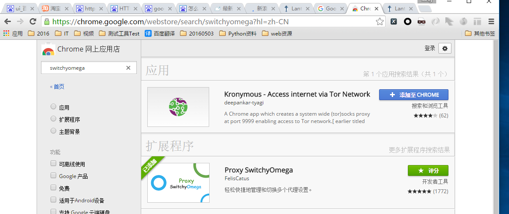
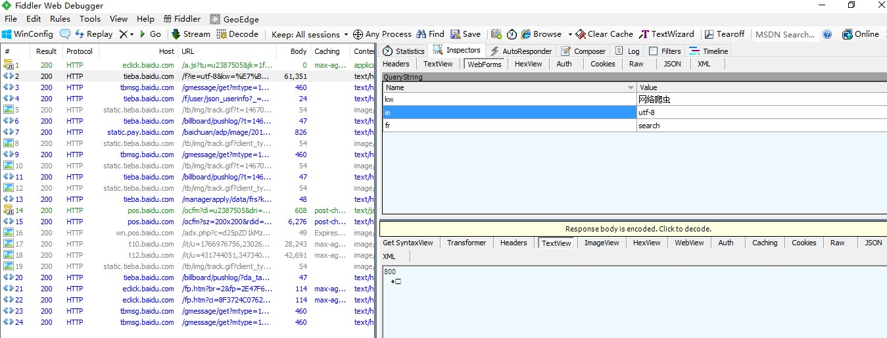
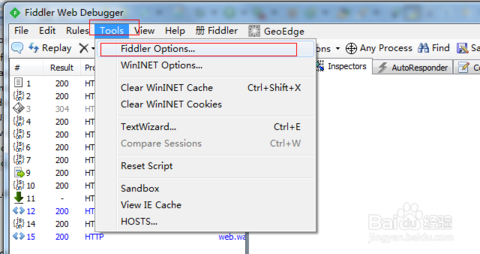

# HTTP代理神器Fidder

Fiddler是一款强大Web调试工具，它能记录所有客户端和服务器的HTTP请求

## 工作原理

Fiddler 是以代理web服务器的形式工作的，它使用代理地址:127.0.0.1，端口:8888。

### Fiddler 如何捕获Chrome的会话

### Fiddler 如何捕获Firefox的会话

能支持HTTP代理的任意程序的数据包都能被Fiddler嗅探到，Fiddler的运行机制其实就是本机上监听8888端口的HTTP代理。 Fiddler2启动的时候默认IE的代理设为了127.0.0.1:8888，而其他浏览器是需要手动设置的，所以将Firefox的代理改为127.0.0.1:8888就可以监听数据了。 Firefox 上通过如下步骤设置代理 点击: Tools -> Options, 在Options 对话框上点击Advanced tab - > network tab -> setting.

## Fiddler如何捕获HTTPS会话

默认下，Fiddler不会捕获HTTPS会话，需要你设置下， 打开Fiddler Tool->Fiddler Options->HTTPS tab

选中checkbox， 弹出如下的对话框，点击"YES"

点击"Yes" 后，就设置好了。

### Fiddler的基本界面

看看Fiddler的基本界面

特别注意： 遇到这个Click请点击Click 

# 模拟手机应用进行抓包

### 用Fiddler对Android应用进行抓包

- 启动Fiddler，打开菜单栏中的 Tools > Fiddler Options，打开“Fiddler Options”对话框。

- 在Fiddler Options”对话框切换到“Connections”选项卡，然后勾选“Allow romote computers to connect”后面的复选框，然后点击“OK”按钮。

- 在本机命令行输入：ipconfig，找到本机的ip地址。

- 打开android设备的“设置”->“WLAN”，找到你要连接的网络，在上面长按，然后选择“修改网络”，弹出网络设置对话框，然后勾选“显示高级选项”。

- 在“代理”后面的输入框选择“手动”，在“代理服务器主机名”后面的输入框输入电脑的ip地址，在“代理服务器端口”后面的输入框输入8888，然后点击“保存”按钮。

- 然后启动android设备中的浏览器，访问百度的首页，在fiddler中可以看到完成的请求和响应数据。

