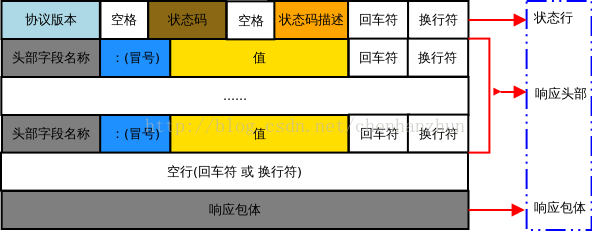

超文本传输协议(Hypertext Transfer Protocol，简称HTTP)是应用层协议。HTTP 是一种请求/响应式的协议，即一个客户端与服务器建立连接后，向服务器发送一个请求;服务器接到请求后，给予相应的响应信息。

## HTTP 请求报文

HTTP 请求报文由请求行、请求头部、空行 和 请求包体 4 个部分组成，如下图所示：


下面对请求报文格式进行简单的分析：

**请求行：**请求行由方法字段、URL 字段 和HTTP 协议版本字段 3 个部分组成，他们之间使用空格隔开。常用的 HTTP 请求方法有 GET、POST、HEAD、PUT、DELETE、OPTIONS、TRACE、CONNECT;

● GET：当客户端要从服务器中读取某个资源时，使用GET 方法。GET 方法要求服务器将URL 定位的资源放在响应报文的数据部分，回送给客户端，即向服务器请求某个资源。使用GET 方法时，请求参数和对应的值附加在 URL 后面，利用一个问号(“?”)代表URL 的结尾与请求参数的开始，传递参数长度受限制。例如，/index.jsp?id=100&op=bind。

● POST：当客户端给服务器提供信息较多时可以使用POST 方法，POST 方法向服务器提交数据，比如完成表单数据的提交，将数据提交给服务器处理。GET 一般用于获取/查询资源信息，POST 会附带用户数据，一般用于更新资源信息。POST 方法将请求参数封装在HTTP 请求数据中，以名称/值的形式出现，可以传输大量数据;

**请求头部：**请求头部由关键字/值对组成，每行一对，关键字和值用英文冒号“:”分隔。请求头部通知服务器有关于客户端请求的信息，典型的请求头有：

● User-Agent：产生请求的浏览器类型;

● Accept：客户端可识别的响应内容类型列表;星号 “ * ” 用于按范围将类型分组，用 “ */* ” 指示可接受全部类型，用“ type/* ”指示可接受 type 类型的所有子类型;

● Accept-Language：客户端可接受的自然语言;

● Accept-Encoding：客户端可接受的编码压缩格式;

● Accept-Charset：可接受的应答的字符集;

● Host：请求的主机名，允许多个域名同处一个IP 地址，即虚拟主机;

● connection：连接方式(close 或 keepalive);

● Cookie：存储于客户端扩展字段，向同一域名的服务端发送属于该域的cookie;

**空行：**最后一个请求头之后是一个空行，发送回车符和换行符，通知服务器以下不再有请求头;

**请求包体：**请求包体不在 GET 方法中使用，而是在POST 方法中使用。POST 方法适用于需要客户填写表单的场合。与请求包体相关的最常使用的是包体类型 Content-Type 和包体长度 Content-Length;

## HTTP 响应报文

HTTP 响应报文由状态行、响应头部、空行 和 响应包体 4 个部分组成，如下图所示：



下面对响应报文格式进行简单的分析：

**状态行：**状态行由 HTTP 协议版本字段、状态码和状态码的描述文本 3 个部分组成，他们之间使用空格隔开;

● 状态码由三位数字组成，第一位数字表示响应的类型，常用的状态码有五大类如下所示：

1xx：表示服务器已接收了客户端请求，客户端可继续发送请求;

2xx：表示服务器已成功接收到请求并进行处理;

3xx：表示服务器要求客户端重定向;

4xx：表示客户端的请求有非法内容;

5xx：表示服务器未能正常处理客户端的请求而出现意外错误;

● 状态码描述文本有如下取值：

200 OK：表示客户端请求成功;

400 Bad Request：表示客户端请求有语法错误，不能被服务器所理解;

401 Unauthonzed：表示请求未经授权，该状态代码必须与 WWW-Authenticate 报头域一起使用;

403 Forbidden：表示服务器收到请求，但是拒绝提供服务，通常会在响应正文中给出不提供服务的原因;

404 Not Found：请求的资源不存在，例如，输入了错误的URL;

500 Internal Server Error：表示服务器发生不可预期的错误，导致无法完成客户端的请求;

503 Service Unavailable：表示服务器当前不能够处理客户端的请求，在一段时间之后，服务器可能会恢复正常;

**响应头部：**响应头可能包括：

Location：Location响应报头域用于重定向接受者到一个新的位置。例如：客户端所请求的页面已不存在原先的位置，为了让客户端重定向到这个页面新的位置，服务器端可以发回Location响应报头后使用重定向语句，让客户端去访问新的域名所对应的服务器上的资源;

Server：Server 响应报头域包含了服务器用来处理请求的软件信息及其版本。它和 User-Agent 请求报头域是相对应的，前者发送服务器端软件的信息，后者发送客户端软件(浏览器)和操作系统的信息。

Vary：指示不可缓存的请求头列表;

Connection：连接方式;

对于请求来说：close(告诉 WEB 服务器或者代理服务器，在完成本次请求的响应后，断开连接，不等待本次连接的后续请求了)。keepalive(告诉WEB服务器或者代理服务器，在完成本次请求的响应后，保持连接，等待本次连接的后续请求);

对于响应来说：close(连接已经关闭); keepalive(连接保持着，在等待本次连接的后续请求); Keep-Alive：如果浏览器请求保持连接，则该头部表明希望WEB 服务器保持连接多长时间(秒);例如：Keep-Alive：300;

WWW-Authenticate：WWW-Authenticate响应报头域必须被包含在401 (未授权的)响应消息中，这个报头域和前面讲到的Authorization 请求报头域是相关的，当客户端收到 401 响应消息，就要决定是否请求服务器对其进行验证。如果要求服务器对其进行验证，就可以发送一个包含了Authorization 报头域的请求;

**空行：**最后一个响应头部之后是一个空行，发送回车符和换行符，通知服务器以下不再有响应头部。

**响应包体：**服务器返回给客户端的文本信息;

## HTTP 工作原理

HTTP 协议采用请求/响应模型。客户端向服务器发送一个请求报文，服务器以一个状态作为响应。

以下是 HTTP 请求/响应的步骤：

● 客户端连接到web服务器：HTTP 客户端与web服务器建立一个 TCP 连接;

● 客户端向服务器发起 HTTP 请求：通过已建立的TCP 连接，客户端向服务器发送一个请求报文;

● 服务器接收 HTTP 请求并返回 HTTP 响应：服务器解析请求，定位请求资源，服务器将资源副本写到 TCP 连接，由客户端读取;

● 释放 TCP 连接：若connection 模式为close，则服务器主动关闭TCP 连接，客户端被动关闭连接，释放TCP 连接;若connection 模式为keepalive，则该连接会保持一段时间，在该时间内可以继续接收请求;

● 客户端浏览器解析HTML内容：客户端将服务器响应的 html 文本解析并显示;

例如：在浏览器地址栏键入URL，按下回车之后会经历以下流程：

1、浏览器向 DNS 服务器请求解析该 URL 中的域名所对应的 IP 地址;

2、解析出 IP 地址后，根据该 IP 地址和默认端口 80，和服务器建立 TCP 连接;

3、浏览器发出读取文件(URL 中域名后面部分对应的文件)的HTTP 请求，该请求报文作为 TCP 三次握手的第三个报文的数据发送给服务器;

4、服务器对浏览器请求作出响应，并把对应的 html 文本发送给浏览器;

5、释放 TCP 连接;

6、浏览器将该 html 文本并显示内容;

## HTTP 无状态性

HTTP 协议是无状态的(stateless)。也就是说，同一个客户端第二次访问同一个服务器上的页面时，服务器无法知道这个客户端曾经访问过，服务器也无法分辨不同的客户端。HTTP 的无状态特性简化了服务器的设计，使服务器更容易支持大量并发的HTTP 请求。

## HTTP 持久连接

HTTP1.0 使用的是非持久连接，主要缺点是客户端必须为每一个待请求的对象建立并维护一个新的连接，即每请求一个文档就要有两倍RTT 的开销。因为同一个页面可能存在多个对象，所以非持久连接可能使一个页面的下载变得十分缓慢，而且这种短连接增加了网络传输的负担。HTTP1.1 使用持久连接keepalive，所谓持久连接，就是服务器在发送响应后仍然在一段时间内保持这条连接，允许在同一个连接中存在多次数据请求和响应，即在持久连接情况下，服务器在发送完响应后并不关闭TCP 连接，而客户端可以通过这个连接继续请求其他对象。

HTTP/1.1 协议的持久连接有两种方式：

● 非流水线方式：客户在收到前一个响应后才能发出下一个请求;

● 流水线方式：客户在收到 HTTP 的响应报文之前就能接着发送新的请求报文;

最后给出一个具体例子：

```
Remote Address:116.57.254.104:80   
Request URL:http://hr.tencent.com/   
Request Method:GET   
Status Code:200 OK   

Request Headers   
GET / HTTP/1.1   
Host: hr.tencent.com   
Connection: keep-alive   
Accept: text/html,application/xhtml+xml,application/xml;q=0.9,image/webp,*/*;q=0.8   
User-Agent: Mozilla/5.0 (X11; Linux i686) AppleWebKit/537.36 (KHTML, like Gecko) Chrome/35.0.1916.114 Safari/537.36   
Accept-Encoding: gzip,deflate,sdch   
Accept-Language: en-US,en;q=0.8,zh-CN;q=0.6,zh;q=0.4   
Cookie: pgv_pvi=2098703360; PHPSESSID=bc7onl0dojbsatscsfv79pds77; pgv_info=ssid=s1454606128;    
        pgv_pvid=926725350; ts_uid=4084753309   

Response Header   
HTTP/1.1 200 OK   
Server: nginx   
Date: Mon, 26 Jan 2015 01:09:10 GMT   
Content-Type: text/html;charset=utf-8   
Content-Length: 3631   
Connection: keep-alive   
X-Powered-By: PHP/5.3.10   
Expires: Thu, 19 Nov 1981 08:52:00 GMT   
Cache-Control: no-store, no-cache, must-revalidate, post-check=0, pre-check=0   
Pragma: no-cache   
Vary: Accept-Encoding   
Content-Encoding: gzip
```

从请求报文可以知道：

```
GET / HTTP/1.1
```

请求方法 GET 表示一个读取请求，将从服务器获得网页数据，/表示URL 的路径，URL 总是以/开头，/就表示首页，最后的HTTP/1.1 指示采用的 HTTP 协议版本是 1.1;请求域名如下所示：

```
Host: hr.tencent.com
```

响应报文如下：

```
HTTP/1.1 200 OK   
Server: nginx
```