# 网络编程

- [Java基础：网络编程](http://blog.csdn.net/axi295309066/article/details/52854772)
- [Uri、URL、UriMatcher、ContentUris详解](http://blog.csdn.net/axi295309066/article/details/60129690)
- [Android应用开发：网络编程1](http://blog.csdn.net/axi295309066/article/details/50315017)
- [Android应用开发：网络编程2](http://blog.csdn.net/axi295309066/article/details/50330375)


如同两个国家元首的会晤过程需要遵守一定的外交礼节一样，在浏览器与服务器的交互过程中，也要遵循一定的规则，这个规则就是HTTP。HTTP专门用于定义浏览器与服务器之间交换数据的过程以及数据本身的格式。对于从事Web开发的人员来说，只有深入理解HTTP，才能更好地开发、维护、管理Web应用。

# 1. 什么是HTTP协议

HTTP是Hyper Text Transfer Protocol的缩写，即超文本传输协议。它是一种请求/响应式的协议，客户端在与服务器端建立连接后，就可以向服务器端发送请求，这种请求被称作HTTP请求，服务器端接收到请求后会做出响应，称为HTTP响应，客户端与服务器端在HTTP下的交互过程如图所示。

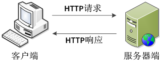

从图中可以清楚地看到客户端与服务器端使用HTTP通信的过程，接下来总结一下HTTP协议的特点，具体如下。

- 支持客户端(浏览器就是一种Web客户端)/服务器模式。
- 简单快速：客户端向服务器请求服务时，只需传送请求方式和路径。常用的请求方式有GET、POST等，每种方式规定了客户端与服务器联系的类型不同。由于HTTP简单，使得HTTP服务器的程序规模小，因而通信速度很快。
- 灵活：HTTP允许传输任意类型的数据，正在传输的数据类型由Content-Type加以标记。
- 无状态：HTTP是无状态协议。无状态是指协议对于事务处理没有记忆能力，如果后续处理需要前面的信息，则它必须重传，这样可能导致每次连接传送的数据量增大。

客户端连上web服务器后，若想获得web服务器中的某个web资源，需遵守一定的通讯格式，HTTP协议用于定义客户端与web服务器通迅的格式。

HTTP是hypertext transfer protocol（超文本传输协议）的简写，它是TCP/IP协议的一个应用层协议，用于定义WEB浏览器与WEB服务器之间交换数据的过程。这个协议详细规定了浏览器和万维网服务器之间互相通信的规则。

HTTP就是一个通信规则，通信规则规定了客户端发送给服务器的内容格式，也规定了服务器发送给客户端的内容格式。其实我们要学习的就是这个两个格式！客户端发送给服务器的格式叫“请求协议”；服务器发送给客户端的格式叫“响应协议”。

HTTP协议是学习JavaWeb开发的基石，不深入了解HTTP协议，就不能说掌握了WEB开发，更无法管理和维护一些复杂的WEB站点。

## OSI网络七层协议

| 网络层级  | 协议                                       |
| :---- | :--------------------------------------- |
| 应用层   | 主要是一些终端的应用，如浏览器，HTTP、HTTPS、FTP、SMTP、POP3、TELNET |
| 表示层   | 主要是进行对接收的数据进行解释、加密与解密、压缩与解压缩等            |
| 会话层   | 通过传输层（端口号：传输端口与接收端口）建立数据传输的通路            |
| 传输层   | 定义了一些传输数据的协议和端口号，如TCP、UDP                |
| 网络层   | IP，主要将从下层接收到的数据进行IP地址的封装与解封装。在这一层工作的设备是路由器，常把这一层的数据叫做数据包。 |
| 数据链路层 | 主要将从物理层接收的数据进行MAC地址（网卡的地址）的封装与解封装        |
| 物理层   | 主要定义物理设备标准，如网线的接口类型、光纤的接口类型、各种传输介质的传输速率等。它的主要作用是传输比特流。 |


# 2. HTTP协议简介

协议是指计算机通信网络中两台计算机之间进行通信所必须共同遵守的规定或规则，HTTP协议(超文本传输协议)是一种通信协议，它允许将HTML(超文本标记语言)文档从Web服务器传送到客户端的浏览器。

HTTP协议是应用层协议，HTTP使用请求-响应的方式进行传输，一个请求对应一个响应，并且请求只能是由客户端发起的。

# 3. HTTP1.0和HTTP1.1的区别

HTTP自诞生以来，先后经历了很多版本，其中，最早的版本是HTTP 0.9，它于1990年被提出。后来，为了进一步完善HTTP，先后在1996年提出了版本1.0，在1997年提出了版本1.1。由于HTTP 0.9版本已经过时，这里不作过多讲解。接下来，只针对HTTP 1.0和HTTP 1.1进行详细地讲解。

**（1）HTTP1.0**

基于HTTP 1.0协议的客户端与服务器在交互过程中需要经过建立连接、发送请求信息、回送响应信息、关闭连接4个步骤，具体交互过程如图所示。

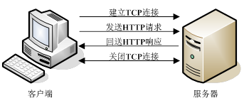

从图中可以看出，客户端与服务器建立连接后，每次只能处理一个HTTP请求。对于内容丰富的网页来说，这样的通信方式明显有缺陷。例如，下面的一段HTML代码：


上面的HTML文档中包含三个标记，由于标记的src属性指明的是图片的URL地址，因此，当客户端访问这些图片时，需要发送三次请求，并且每次请求都需要与服务器重新建立连接。如此一来，必然导致客户端与服务器端交互耗时，影响网页的访问速度。

**（2）HTTP1.1**

为了克服上述HTTP1.0的缺陷，HTTP1.1

版本应运而生，它支持持久连接，也就是说在一个TCP连接上可以传送多个HTTP请求和响应，从而减少了建立和关闭连接的消耗和延时。基于HTTP1.1的客户端和服务器端的交互过程，如图所示。

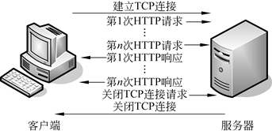

从图中可以看出，当客户端与服务器端建立连接后，客户端可以向服务器端发送多个请求，并且在发送下个请求时，无需等待上次请求的返回结果。但服务器必须按照接受客户端请求的先后顺序依次返回响应结果，以保证客户端能够区分出每次请求的响应内容。由此可见，HTTP1.1不仅继承了HTTP1.0的优点，而且有效解决了HTTP1.0的性能问题，显著地减少浏览器与服务器交互所需要的时间。

在HTTP1.0协议中，客户端与web服务器建立连接后，只能获得一个web资源。

HTTP1.1协议，允许客户端与web服务器建立连接后，在一个连接上获取多个web资源。

# 打开一个网页需要浏览器发送多次Request

一个好多同学搞不清楚的问题：

一个web页面中，使用img标签引用了三幅图片，当客户端访问服务器中的这个web页面时，客户端总共会访问几次服务器，即向服务器发送了几次HTTP请求。

1. 当你在浏览器输入URL `http://www.cnblogs.com` 的时候，浏览器发送一个Request去获取 `http://www.cnblogs.com` 的html.  服务器把Response发送回给浏览器
2. 浏览器分析Response中的 HTML，发现其中引用了很多其他文件，比如图片，CSS文件，JS文件
3. 浏览器会自动再次发送Request去获取图片，CSS文件，或者JS文件
4. 等所有的文件都下载成功后。 网页就被显示出来了

## Http网络请求原理

Http是一种应用层协议，它通过tcp实现了可靠的数据传输，能够保证数据的完整性、正确性，而tcp对于数据传输控制的优点也能够体现在Http上，使得Http的数据传输吞吐量、效率得到保证。

对于移动开发来说，网络应用基本上都是C/S架构，也就是客户端/服务器架构。客户端通过向服务器发起特定的请求，服务器返回结果，客户端解析结果，再将结果展示在UI上。

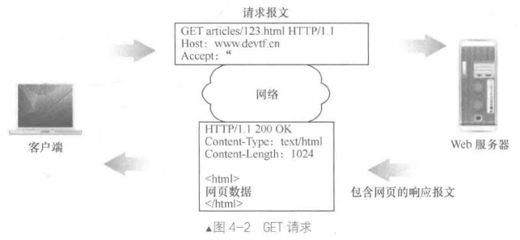

HTTP实际上是基于TCP协议，而TCP协议又是基于Socket，Socket实际上操作的也就是输入、输出流，输出流是向服务器写数据，输入流是向服务器读取数据。

# 4. 协议

协议：协议的甲乙双方，就是客户端（浏览器）和服务器！

理解成双方通信的格式！

- 请求协议
- 响应协议

# 5. HttpWatch和FireBug

HttpWatch是专门为IE浏览器提供的，用来查看HTTP请求和响应内容的工具。而FireFox上需要安装FireBug软件。如果你使用的是Chrome，那么就不用自行安装什么工具了，因为它自身就有查看请求和响应内容的功能！

HttpWatch和FireBug这些工具对浏览器而言不是必须的，但对我们开发者是很有帮助的，通过查看HTTP请求响应内容，可以使我们更好的学习HTTP协议。

# 6. 请求协议

请求方法，各个方法的解释如下：

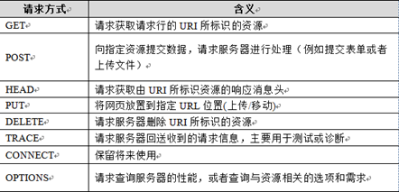

| 方法      | 解释                             |
| :------ | :----------------------------- |
| GET     | 请求获取Request-URI所标识的资源          |
| POST    | 在Request-URI所标识的资源后附加新的数据      |
| HEAD    | 请求获取由Request-URI所标识的资源的响应消息报头  |
| PUT     | 请求服务器存储一个资源，并用Request-URI作为其标识 |
| DELETE  | 请求服务器删除Request-URI所标识的资源       |
| TRACE   | 请求服务器回送收到的请求信息，主要用于测试或诊断       |
| CONNECT | 保留将来使用                         |
| OPTIONS | 请求查询服务器的性能，或者查询与资源相关的选项和需求     |

请求协议的格式如下：

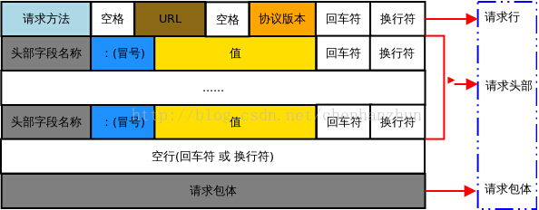

```
请求首行；
请求头信息；
空行；
请求体。
```

浏览器发送给服务器的内容就这个格式的，如果不是这个格式服务器将无法解读！在HTTP协议中，请求有很多请求方法，其中最为常用的就是GET和POST。不同的请求方法之间的区别，后面会一点一点的介绍。

## 6.1 GET请求

Get是最常用的方法，它的作用是获取服务器中的某个资源。客户端用Get方法发起一次Http请求，服务器将对应的资源返回给客户端。

需要注意的是，Get请求的参数都需要放到请求的URL中，第一个参数之前有一个"?"，参数的格式为：参数名=参数值，参数之间用"&"链接

打开IE，在访问hello项目的index.jsp之前打开HttpWatch，并点击“Record”按钮。然后访问index.jsp页面。查看请求内容如下：

```
GET /hello/index.jsp HTTP/1.1
Host: localhost
User-Agent: Mozilla/5.0 (Windows NT 5.1; rv:5.0) Gecko/20100101 Firefox/5.0
Accept: text/html,application/xhtml+xml,application/xml;q=0.9,*/*;q=0.8
Accept-Language: zh-cn,zh;q=0.5
Accept-Encoding: gzip, deflate
Accept-Charset: GB2312,utf-8;q=0.7,*;q=0.7
Connection: keep-alive
Cookie: JSESSIONID=369766FDF6220F7803433C0B2DE36D98
```

- `GET /hello/index.jsp HTTP/1.1`：GET请求，请求服务器路径为/hello/index.jsp，协议为1.1

- `Host:localhost`：请求的主机名为localhost

- `User-Agent: Mozilla/5.0 (Windows NT 5.1; rv:5.0) Gecko/20100101 Firefox/5.0`：
  与浏览器和OS相关的信息。有些网站会显示用户的系统版本和浏览器版本信息，这都是通过获取User-Agent头信息而来的

- `Accept: text/html,application/xhtml+xml,application/xml;q=0.9,*/*;q=0.8`：
  告诉服务器，当前客户端可以接收的文档类型，其实这里包含了*/*，就表示什么都可以接收

- `Accept-Language: zh-cn,zh;q=0.5`
  当前客户端支持的语言，可以在浏览器的工具→选项中找到语言相关信息
- `Accept-Encoding: gzip, deflate`：支持的压缩格式。数据在网络上传递时，可能服务器会把数据压缩后再发送

- `Accept-Charset: GB2312,utf-8;q=0.7,*;q=0.7`：客户端支持的编码

- `Connection: keep-alive`：客户端支持的链接方式，保持一段时间链接，默认为3000ms

- `Cookie: JSESSIONID=369766FDF6220F7803433C0B2DE36D98`
  因为不是第一次访问这个地址，所以会在请求中把上一次服务器响应中发送过来的Cookie在请求中一并发送去过；这个Cookie的名字为JSESSIONID

## 6.2 POST请求

POST方法起初是用来向服务器传递数据的，实际上，POST请求通常会用来提交HTML的表单数据。表单中填好的数据会传输给服务器，然后由服务器对这些数据进行处理。

为了演示POST请求，我们需要修改index.jsp页面，即添加一个表单：

```html
<form action="" method="post">
  关键字：<input type="text" name="keyword"/>
  <input type="submit" value="提交"/>
</form>
```


打开HttpWatch，输入hello后点击提交，查看请求内容如下：

```
POST /hello/index.jsp HTTP/1.1
Accept: image/gif, image/jpeg, image/pjpeg, image/pjpeg, application/msword, application/vnd.ms-excel, application/vnd.ms-powerpoint, application/x-ms-application, application/x-ms-xbap, application/vnd.ms-xpsdocument, application/xaml+xml, */*
Referer: http://localhost:8080/hello/index.jsp
Accept-Language: zh-cn,en-US;q=0.5
User-Agent: Mozilla/4.0 (compatible; MSIE 7.0; Windows NT 5.1; Trident/4.0; InfoPath.2; .NET CLR 2.0.50727; .NET CLR 3.0.4506.2152; .NET CLR 3.5.30729)
Content-Type: application/x-www-form-urlencoded
Accept-Encoding: gzip, deflate
Host: localhost:8080
Content-Length: 13
Connection: Keep-Alive
Cache-Control: no-cache
Cookie: JSESSIONID=E365D980343B9307023A1D271CC48E7D

keyword=hello
```
POST请求是可以有请求体的，而GET请求不能有请求体。

- `Referer: http://localhost:8080/hello/index.jsp`

  请求来自哪个页面，例如你在百度上点击链接到了这里，那么`Referer:http://www.baidu.com`；如果你是在浏览器的地址栏中直接输入的地址，那么就没有Referer这个请求头了

- `Content-Type: application/x-www-form-urlencoded`

  表单的数据类型，说明会使用url格式编码数据；url编码的数据都是以“%”为前缀，后面跟随两位的16进制，例如“传智”这两个字使用UTF-8的url编码用为“%E4%BC%A0%E6%99%BA”

- Content-Length:13：请求体的长度，这里表示13个字节

- keyword=hello：请求体内容！hello是在表单中输入的数据，keyword是表单字段的名字。

Referer请求头是比较有用的一个请求头，它可以用来做统计工作，也可以用来做防盗链。

## 6.3 统计工作

我公司网站在百度上做了广告，但不知道在百度上做广告对我们网站的访问量是否有影响，那么可以对每个请求中的Referer进行分析，如果Referer为百度的很多，那么说明用户都是通过百度找到我们公司网站的。

## 6.4 防盗链

我公司网站上有一个下载链接，而其他网站盗链了这个地址，例如在我网站上的index.html页面中有一个链接，点击即可下载JDK7.0，但有某个人的微博中盗链了这个资源，它也有一个链接指向我们网站的JDK7.0，也就是说登录它的微博，点击链接就可以从我网站上下载JDK7.0，这导致我们网站的广告没有看，但下载的却是我网站的资源。这时可以使用Referer进行防盗链，在资源被下载之前，我们对Referer进行判断，如果请求来自本网站，那么允许下载，如果非本网站，先跳转到本网站看广告，然后再允许下载

### PUT请求

与GET请求从服务器读取数据相反，PUT方法会向服务器写入资源。

### DELETE

顾名思义，delete方法所做的事情就是请服务器删除请求url中指定的资源

### HEAD

head方法与get方法类似，但服务器在响应中只返回首部

### TRACE

客户端发起一个请求时，这个请求可能要穿过防火墙、代理、网关或其他一些应用程序。每个中间节点都有可能修改原始的Http请求。TRACE方法允许客户端在最终将请求发给服务器时，看看它变成了什么样子。

TRACE请求会在目的服务器发起一个“回环”诊断。

### OPTIONS

OPTIONS方法请求Web服务器告知其支持的各种功能。

### 请求头

请求头通知服务器关于客户端请求的信息

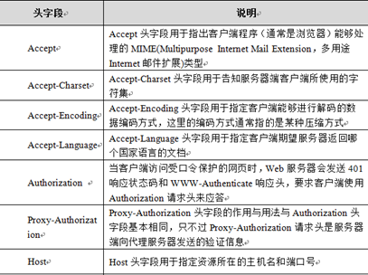

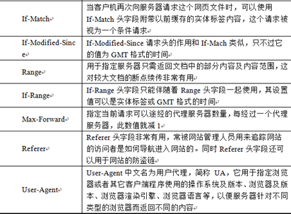

| 请求头字段                         | 作用               |
| :---------------------------- | :--------------- |
| User-Agent                    | 发出请求的浏览器类型和系统信息  |
| Host                          | 请求的主机名，主机名：端口号   |
| Accept-Encoding：gzip,compress | 支持的压缩格式          |
| Accept：text/html              | 客户端可以接受的文档类型     |
| Accept-Charset                | 客户端支持的编码格式       |
| Accept-Language               | 客户端支持的语言         |
| Authorization                 | 授权，用于设置身份认证信息    |
| Range:bytes=100-1000          | 请求部分数据           |
| Referer                       | 请求来源，用于防盗链、访问统计等 |
| Cookie                        | 会话跟踪，用户身份的识别     |

###  通用头字段
| 头字段              | 作用                                       |
| :--------------- | :--------------------------------------- |
| Date             | 时间                                       |
| Cache-Control    | 取值为一般为no-cache或max-age=XX，XX为个整数，表示该资源缓存有效期(秒) |
| Connection       | keep-alive，是否继续保持链接                      |
| Content-Type     | 请求数据的格式，text/plain，application/json      |
| Content-Length   | 消息长度，请求体/响应体的长度，单位字节                     |
| Content-Encoding | 请求体/响应体的编码格式，如gzip                       |
| Accept-Encoding  | 告知对方我方接受的Content-Encoding                |

### Content-Type

MIME媒体类型，多功能Internet邮件扩展协议（MIME）来描述。MIME的定义形式为“[type]/[subtype]”，其中，[type]用来描述数据类型的大类，而[subtype]用来描述数据类型的子类。例如，"text/html"描述的数据类型的大类是文本（text），而子类是超文本标记语言（html）；a/b，a为主类型，b为子类型，image/gif；`*/*`：所有格式

Post请求的Content-Type

| 类型                                | 作用             |
| :-------------------------------- | :------------- |
| application/x-www-form-urlencoded | 表单数据，key-value |
| application/octet-stream          | 字节流            |
| application/json                  | json           |
| multipart/form-data               | 二进制，file，文件上传  |
| text/plain                        | 普通文本，默认类型      |
| text/xml                          | xml类型的文本       |
| text/html;charset=utf-8           | html类型的文本      |
| image/png，image/jpeg，image/gif    | 图片             |

```java
HttpURLConnection connection = ...;
connection.setRequestProperty("Content-Type", "application/x-www-form-urlencoded");
```

### 实体头字段

如果服务器希望浏览器不是直接处理响应的实体内容，而是让用户选择将响应的实体内容保存到一个文件中，这需要使用Content-Disposition头字段。Content-Disposition头字段没有在HTTP的标准规范中定义，它是从RFC2183中借鉴过来的。在RFC2183中，Content-Disposition指定了接收程序处理数据内容的方式，有inline和attachment两种标准方式，inline表示直接处理，而attachment则要求用户干预并控制接收程序处理数据内容的方式。而在HTTP应用中，只有attachment是Content-Disposition的标准方式。attachment后面还可以指定filename参数。filename参数值是服务器建议浏览器保存实体内容的文件名称，浏览器应该忽略filename参数值中的目录部分，只取参数中的最后部分作为文件名。在设置Content-Disposition之前，一定要设置Content-Type头字段，具体示例如下：


- 普通表单项

Content-Disposition:form-data;name="username" 表单项名称

- 文件表单项

Content-Disposition:form-data;name="uploadFile";filename="a.txt" 表单项名称，上传文件名称

- 下载文件

Content-Disposition:attachment;filename="filename"让浏览器弹出下载框

# 7. 响应协议

在接收和解释请求消息后，服务器返回一个HTTP响应消息。

## 7.1 响应内容

响应协议的格式如下：


```
响应首行；
响应头信息；
空行；
响应体。
```
响应内容是由服务器发送给浏览器的内容，浏览器会根据响应内容来显示。
```
HTTP/1.1 200 OK
Server: Apache-Coyote/1.1
Content-Type: text/html;charset=UTF-8
Content-Length: 724
Set-Cookie: JSESSIONID=C97E2B4C55553EAB46079A4F263435A4; Path=/hello
Date: Wed, 25 Sep 2012 04:15:03 GMT
```

```html
<!DOCTYPE HTML PUBLIC "-//W3C//DTD HTML 4.01 Transitional//EN">
<html>
  <head>
    <base href="http://localhost:8080/hello/">

    <title>My JSP 'index.jsp' starting page</title>
	<meta http-equiv="pragma" content="no-cache">
	<meta http-equiv="cache-control" content="no-cache">
	<meta http-equiv="expires" content="0">    
	<meta http-equiv="keywords" content="keyword1,keyword2,keyword3">
	<meta http-equiv="description" content="This is my page">
	<!--
	<link rel="stylesheet" type="text/css" href="styles.css">
	-->
  </head>

  <body>
<form action="" method="post">
  关键字：<input type="text" name="keyword"/>
  <input type="submit" value="提交"/>
</form>
  </body>
</html>
```

- HTTP/1.1 200 OK：响应协议为HTTP1.1，状态码为200，表示请求成功，OK是对状态码的解释
- Server: Apache-Coyote/1.1：服务器的版本信息
- Content-Type: text/html;charset=UTF-8：响应体使用的编码为UTF-8
- Content-Length: 724：响应体为724字节
- Set-Cookie: JSESSIONID=C97E2B4C55553EAB46079A4F263435A4; Path=/hello：响应给客户端的Cookie
- Date: Wed, 25 Sep 2012 04:15:03 GMT：响应的时间，这可能会有8小时的时区差

## 7.2 若干响应头

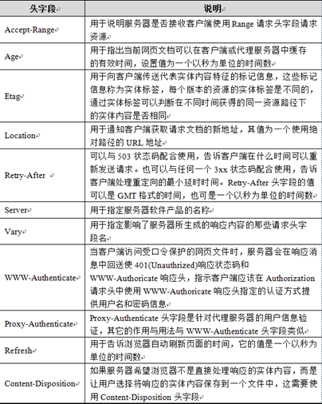

| 响应头                                      | 功能描述                        |
| :--------------------------------------- | :-------------------------- |
| Content-Encoding: gzip                   | 服务器发送数据时使用的压缩格式             |
| Server:apache tomcat                     | 服务器的基本信息                    |
| Content-Length: 80                       | 发送数据的大小                     |
| Content-Language: zh-cn                  | 发送的数据使用的语言环境                |
| Content-Disposition: attachment;filename=aaa.zip | 与下载相关的头                     |
| Expires: -1                              | 指定资源缓存的时间，如果取值为0或-1浏览就不缓存资源 |
| Cache-Control: no-cache                  | 缓存相关的头，如果为no-cache则通知浏览器不缓存 |
| Pragma: no-cache                         | 缓存相关的头，如果为no-cache则不缓存      |
| Connection: close/Keep-Alive             | 是否保持连接                      |
| Location                                 | 配合302实现请求重定向                |
| Content-Type                             | 发送数据的类型和编码                  |
| Last-Modified                            | 最后修改时间                      |
| Refresh                                  | 自动刷新，n秒后跳转到另一个页面            |
| Set-Cookie                               | 发送Cookie信息                  |
`Location: http://www.it315.org/index.jsp`  配合302实现请求重定向


`Content-Type: text/html; charset=GB2312` 当前所发送的数据的基本信息，（数据的类型，所使用的编码）

`Last-Modified: Tue, 11 Jul 2000 18:23:51 GMT` 缓存相关的头，最后的修改时间

`Refresh: 1;url=http://www.it315.org` 通知浏览器进行定时刷新，此值可以是一个数字指定多长时间以后刷新当前页面，这个数字之后也可以接一个分号后跟一个URL地址指定多长时间后刷新到哪个URL

`Transfer-Encoding: chunked` 传输类型，如果是此值是一个chunked说明当前的数据是一块一块传输的

`Set-Cookie:SS=Q0=5Lb_nQ; path=/search` 和cookie相关的头，后面课程单讲

`ETag: W/"83794-1208174400000"` 和缓存机制相关的头

`Date: Tue, 11 Jul 2000 18:23:51 GMT` 当前时间

## 7.3 响应码

响应码/状态码的职责是当客户端向服务器端发送请求时，描述返回请求结果。借助状态码，用户可以知道服务器端是正常处理了请求，还是出现了什么错误。

响应码有三位数字和原因短信组成组成，第一个数字定义了响应的类别，且有五种可能取值：

- 1xx：指示信息--表示请求已接收，继续处理
- 2xx：成功--表示请求已被成功接收、理解、接受
- 3xx：重定向--要完成请求必须进行更进一步的操作
- 4xx：客户端错误--请求有语法错误或请求无法实现
- 5xx：服务器端错误--服务器未能实现合法的请求

响应头对浏览器来说很重要，它说明了响应的真正含义。例如200表示响应成功了，302表示重定向，这说明浏览器需要再发一个新的请求。

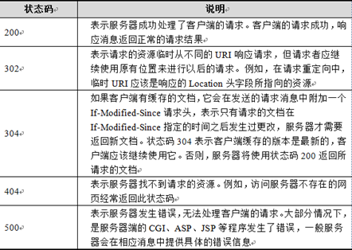

| 响应码  | 描述                                       |
| :--- | :--------------------------------------- |
| 200  | 请求成功，浏览器会把响应体内容（通常是html）显示在浏览器中          |
| 206  | 请求部分资源，和请求头Range使用，多线程下载的时候使用到           |
| 302  | 重定向，当响应码为302时，表示服务器要求浏览器重新再发一个请求，<br/>服务器会发送一个响应头Location，它指定了新请求的URL地址 |
| 304  | 服务器通知浏览器使用缓存                             |
| 307  | 服务器通知浏览器使用缓存                             |
| 400  | bad request 客户端请求有语法错误，不能被服务器理解          |
| 401  | Unauthorized 请求未经授权                      |
| 403  | Forbidden 服务器收到请求，但是拒绝提供服务               |
| 404  | 请求的资源没有找到，说明客户端错误的请求了不存在的资源              |
| 500  | 请求资源找到了，但服务器内部出现了错误                      |
| 501  | server unavailable 服务器当前不能处理客户端的请求，一段时间后可能恢复正常 |
304：当用户第一次请求index.html时，服务器会添加一个名为Last-Modified响应头，这个头说明了index.html的最后修改时间，浏览器会把index.html内容，以及最后响应时间缓存下来。当用户第二次请求index.html时，在请求中包含一个名为If-Modified-Since请求头，它的值就是第一次请求时服务器通过Last-Modified响应头发送给浏览器的值，即index.html最后的修改时间，If-Modified-Since请求头就是在告诉服务器，我这里浏览器缓存的index.html最后修改时间是这个，您看看现在的index.html最后修改时间是不是这个，如果还是，那么您就不用再响应这个index.html内容了，我会把缓存的内容直接显示出来。而服务器端会获取If-Modified-Since值，与index.html的当前最后修改时间比对，如果相同，服务器会发响应码304，表示index.html与浏览器上次缓存的相同，无需再次发送，浏览器可以显示自己的缓存页面，如果比对不同，那么说明index.html已经做了修改，服务器会响应200

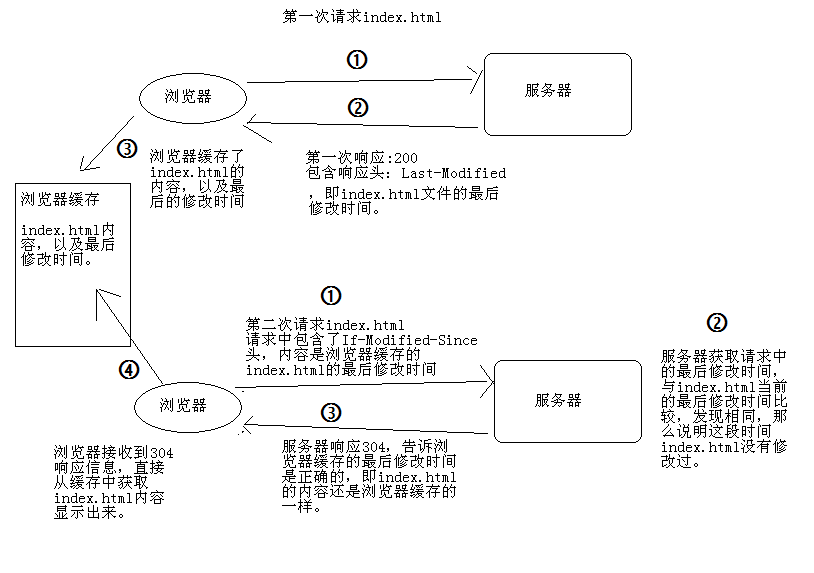

响应头：

- Last-Modified：最后的修改时间

请求头

- If-Modified-Since：把上次请求的index.html的最后修改时间还给服务器；状态码：304，比较If-Modified-Since的时间与文件真实的时间一样时，服务器会响应304，而且不会有响应正文，表示浏览器缓存的就是最新版本

## 7.4 其他响应头

1、告诉浏览器不要缓存的响应头

- Expires: -1
- Cache-Control: no-cache
- Pragma: no-cache

以上三个头都是用来控制缓存的，是因为历史原因造成的，不同的浏览器认识不同的头，我们通常三个一起使用保证通用性

2、自动刷新响应头，浏览器会在3秒之后请求`http://www.itcast.cn`

- `Refresh: 3;url=http://www.itcast.cn`

## 7.5 HTML中指定响应头

在HTMl页面中可以使用`<meta http-equiv="Content-Type" content="text/html; charset=UTF-8">`来指定响应头，例如在index.html页面中给出`<meta http-equiv="Refresh" content="3;url=http://www.itcast.cn">`，表示浏览器只会显示index.html页面3秒，然后自动跳转到`http://www.itcast.cn`

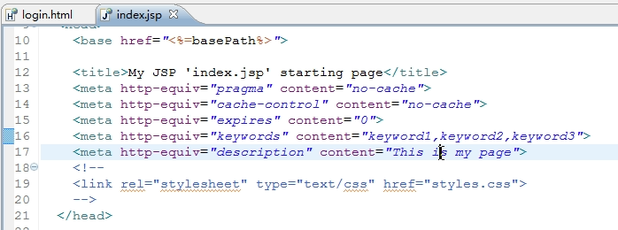

# 8. 模拟网络请求

restClient，这个是firefox上的一个插件，对应chrome浏览器叫做postman，这个插件主要用作和服务器开发人员联调协议

## postman


## restClient


# 9. 测试请求的地址

http://httpbin.org


# 10. gzip压缩
一种压缩格式，一种压缩方式，可以对网络传输的数据进行压缩。减少网络传输的大小

为什么需要压缩?因为经过压缩，可以减少体积，提高传输速度,提高用户体验

## 10.1 浏览器发送器请求的过程

- 发送请求头:Accept-Encoding:gzip
- 服务器压缩数据,返回数据,在响应头里面添加Content-Encoding:gzip
- 客户端,根据Content-Encoding这个响应头,对应解压
  - 有Content-Encoding:gzip → gzip解压
  - 没有Content-Encoding:gzip → 标准解压

app使用gzip压缩：返回的json/xml(文本信息)其实就是个特殊的网页,其实也是可以进行gzip压缩

## 10.2 gzip压缩效果


通过数据，我们得知，文本的压缩率，大概可以达到70%左右。压缩率很高

## 10.3 gzip压缩的实现

```java
try {
	boolean isGzip = false;
	//1.创建httpclient
	DefaultHttpClient httpClient = new DefaultHttpClient();
	//2.创建get请求
	HttpGet get = new HttpGet("http://httpbin.org/gzip");
	//① 添加请求头 Accept-Encoding:"gzip, deflate"
	get.addHeader("Accept-Encoding", "gzip");
	//3.执行请求
	HttpResponse response = httpClient.execute(get);
	if (response.getStatusLine().getStatusCode() == 200) {
		//② 得到响应头,Content-Encoding:"gzip"
		Header[] headers = response.getHeaders("Content-Encoding");
		for (Header header : headers) {
			if (header.getValue().equals("gzip")) {//后台server把数据进行了gzip压缩
				isGzip = true;
			}
		}
		String result = "";
		HttpEntity entity = response.getEntity();
		//③根据是否使用gzip压缩.采取不同的解压方式
		if (isGzip) {
			//④进行gzip的解压
			GZIPInputStream in = new GZIPInputStream(response.getEntity().getContent());
			//in-->string
			result = convertStreamToString(in);
		} else {
			//4.打印结果
			result = EntityUtils.toString(entity);
		}
		System.out.println("result:" + result);
	}
} catch (Exception e) {
	e.printStackTrace();
}
```
# 11. 抓包

## [11.1 Fiddler](http://www.telerik.com/fiddler)
只能抓浏览器返回的包，即只可以抓PC上的包，无法抓手机上的包


## [11.2 Wireshark](https://www.wireshark.org/)
世界上最流行的网络协议分析器，[抓包工具Wireshark基本介绍和学习TCP三次握手](http://blog.csdn.net/axi295309066/article/details/62141352)


通过ping命令拿到网址的IP


# 12. 简单模拟Http服务器

Http实际上是基于TCP的应用层协议，它在更高的层次封装了TCP的使用细节，使网络请求操作更为简易。TCP链接是Internet上基于流的可靠链接，它为Http提供了一条可靠的比特传输管道。从TCP链接一端填入的字节会在另一端以原有的顺序、准确的传送出来

## 简单的服务器实现

```java
public class SimpleHttpServer extends Thread {

    public static void main(String[] args) {
        new SimpleHttpServer().start();
    }

    public static final int HTTP_PORT = 8000;
    ServerSocket mSocket = null;

    public SimpleHttpServer() {
        try {
            mSocket = new ServerSocket(HTTP_PORT);
        } catch (IOException e) {
            e.printStackTrace();
        }

        if (mSocket == null) {
            throw new RuntimeException("服务器Socket初始化失败");
        }
    }

    @Override
    public void run() {
        try {
            while (true) {
                System.out.println("等待连接中");
                new DeliverThread(mSocket.accept()).start(); // accept() 会阻塞
            }

        } catch (IOException e) {
            e.printStackTrace();
        }
    }

    static class DeliverThread extends Thread {
        Socket mClientSocket;
        BufferedReader mInputStream;
        PrintStream mOutputStream;
        /
         * 请求方法,GET、POST等
         */
        String httpMethod;
        /
         * 子路径
         */
        String subPath;
        /
         * 分隔符
         */
        String boundary;

        /
         * 请求参数
         */
        Map<String, String> mParams = new HashMap<String, String>();
        // 请求headers
        Map<String, String> mHeaders = new HashMap<String, String>();
        /
         * 是否已经解析完Header
         */
        boolean isParseHeader = false;

        public DeliverThread(Socket socket) {
            mClientSocket = socket;
        }

        @Override
        public void run() {
            try {
                mInputStream = new BufferedReader(new InputStreamReader(
                        mClientSocket.getInputStream()));
                mOutputStream = new PrintStream(mClientSocket.getOutputStream());
                parseRequest();
                handleResponse();
            } catch (IOException e) {
                e.printStackTrace();
            } finally {
                IoUtils.closeQuitly(mInputStream);
                IoUtils.closeQuitly(mOutputStream);
                IoUtils.closeSocket(mClientSocket);
            }
        }

        private void parseRequest() {
            String line;
            try {
                int lineNum = 0;
                while ((line = mInputStream.readLine()) != null) {
                    // 接收从客户端发送过来的数据
                    if (lineNum == 0) {
                        parseRequestLine(line);
                    }
                    if (isEnd(line)) {
                        break;
                    }

                    if (lineNum != 0 && !isParseHeader) {
                        parseHeaders(line);
                    }
                    if (isParseHeader) {
                        parseRequestParams(line);
                    }

                    lineNum++;
                }
            } catch (IOException e) {
                e.printStackTrace();
            }
        }

        // 是否是结束行
        private boolean isEnd(String line) {
            return line.equals("--" + boundary + "--");
        }

        // 解析请求行
        private void parseRequestLine(String lineOne) {
            String[] tempStrings = lineOne.split(" ");
            httpMethod = tempStrings[0];
            subPath = tempStrings[1];
            System.out.println("请求行,请求方式 : " + tempStrings[0] + ", 子路径 : " + tempStrings[1]
                    + ",HTTP版本 : " + tempStrings[2]);
            System.out.println();
        }

        // 解析header,参数为每个header的字符串
        private void parseHeaders(String headerLine) {
            
            if (headerLine.equals("")) {
                isParseHeader = true;
                System.out.println("-----------> header解析完成\n");
                return;
            } else if (headerLine.contains("boundary")) {
                boundary = parseSecondField(headerLine);
                System.out.println("分隔符 : " + boundary);
            } else {
                parseHeaderParam(headerLine);
            }
        }

        private void parseHeaderParam(String headerLine) {
            String[] keyvalue = headerLine.split(":");
            mHeaders.put(keyvalue[0].trim(), keyvalue[1].trim());
            System.out.println("header参数名 : " + keyvalue[0].trim() + ", 参数值 : "
                    + keyvalue[1].trim());
        }

        // 解析header中的第二个参数
        private String parseSecondField(String line) {
            String[] headerArray = line.split(";");
            parseHeaderParam(headerArray[0]);
            if (headerArray.length > 1) {
                return headerArray[1].split("=")[1];
            }
            return "";
        }

        // 解析请求参数
        private void parseRequestParams(String paramLine) throws IOException {
            if (paramLine.equals("--" + boundary)) {
                String ContentDisposition = mInputStream.readLine();
                String paramName = parseSecondField(ContentDisposition);
                mInputStream.readLine();
                String paramValue = mInputStream.readLine();
                mParams.put(paramName, paramValue);
                System.out.println("参数名 : " + paramName + ", 参数值 : " + paramValue);
            }
        }

        // 返回结果
        private void handleResponse() {
            sleep();
            mOutputStream.println("HTTP/1.1 200 OK");
            mOutputStream.println("Content-Type: application/json");
            mOutputStream.println();
            mOutputStream.println("{\"stCode\":\"success\"}");
        }

        private void sleep() {
            try {
                Thread.sleep(1000);
            } catch (InterruptedException e) {
                e.printStackTrace();
            }
        }

    }

}
```
## http请求,客户端发送
```java
public class HttpPost {
    public String url;
    private Map<String, String> mParamsMap = new HashMap<String, String>();

    Socket mSocket;

    public static void main(String[] args) {
        HttpPost httpPost = new HttpPost("127.0.0.1");
        httpPost.addParam("username", "mr.simple");
        httpPost.addParam("pwd", "my_pwd123");
        httpPost.execute();
    }

    public HttpPost(String url) {
        this.url = url;
    }

    public void addParam(String key, String value) {
        mParamsMap.put(key, value);
    }

    public void execute() {
        try {
            mSocket = new Socket(this.url, SimpleHttpServer.HTTP_PORT);
            PrintStream outputStream = new PrintStream(mSocket.getOutputStream());
            BufferedReader inputStream = new BufferedReader(new InputStreamReader(
                    mSocket.getInputStream()));
            final String boundary = "my_boundary_123";
            // 写入header
            writeHeader(boundary, outputStream);
            // 写入参数
            writeParams(boundary, outputStream);
            // 等待返回数据
            waitResponse(inputStream);
        } catch (UnknownHostException e) {
            e.printStackTrace();
        } catch (IOException e) {
            e.printStackTrace();
        } finally {
            IoUtils.closeSocket(mSocket);
        }
    }

    private void writeHeader(String boundary, PrintStream outputStream) {
        outputStream.println("POST /api/login/ HTTP/1.1");
        outputStream.println("content-length:123");
        outputStream.println("Host:" + this.url + ":" + SimpleHttpServer.HTTP_PORT);
        outputStream.println("Content-Type: multipart/form-data; boundary=" + boundary);
        outputStream.println("User-Agent:android");
        outputStream.println();
    }

    private void writeParams(String boundary, PrintStream outputStream) {
        Iterator<String> paramsKeySet = mParamsMap.keySet().iterator();
        while (paramsKeySet.hasNext()) {
            String paramName = paramsKeySet.next();
            outputStream.println("--" + boundary);
            outputStream.println("Content-Disposition: form-data; name=" + paramName);
            outputStream.println();
            outputStream.println(mParamsMap.get(paramName));
        }
        // 结束符
        outputStream.println("--" + boundary + "--");
    }

    private void waitResponse(BufferedReader inputStream) throws IOException {
        System.out.println("请求结果: ");
        String responseLine = inputStream.readLine();
        while (responseLine == null || !responseLine.contains("HTTP")) {
            responseLine = inputStream.readLine();
        }

        while ((responseLine = inputStream.readLine()) != null) {
            System.out.println(responseLine);
        }
    }
}
```

```java
public class IoUtils {
    public static void closeQuitly(Closeable closeable) {
        if (closeable != null) {
            try {
                closeable.close();
            } catch (IOException e) {
                e.printStackTrace();
            }
        }
    }

    public static void closeSocket(Socket closeable) {
        if (closeable != null) {
            try {
                closeable.close();
            } catch (IOException e) {
                e.printStackTrace();
            }
        }
    }
}
```
# 13. 三次握手链接

三次握手用于请求链接的时候

- 请求端(通常称为客户)发送一个SYN 段指明客户打算连接的服务器的端口，以及初始序号(ISN)
- 服务器发回包含服务器的初始序号的SYN 报文段(报文段2)作为应答。同时，将确认序号设置为客户的ISN加1 以对客户的SYN 报文段进行确认。
- 客户必须将确认序号设置为服务器的ISN 加1 以对服务器的SYN 报文段进行确认(报文段3)这三个报文段完成连接的建立。这个过程也称为三次握手(three-way handshake)。

上面的过程如下图所示：


## 三次握手建立连接

| 标志位                 | 作用                     |
| :------------------ | :--------------------- |
| URG，urgent          | 紧急指针（urgent pointer）有效 |
| ACK，acknowledgement | 确认序号有效                 |
| PSH，push            | 接收方应该尽快将这个报文交给应用层      |
| RST，reset           | 重置连接                   |
| SYN，synchronous     | 发起一个新连接                |
| FIN，finish          | 释放一个连接                 |

所谓三次握手（Three-Way Handshake）即建立TCP连接，就是指建立一个TCP连接时，需要客户端和服务端总共发送3个包以确认连接的建立。在socket编程中，这一过程由客户端执行connect来触发，整个流程如下图所示：

首先Client端发送连接请求报文，Server端接受连接后回复ACK报文，并为这次连接分配资源。Client端接收到ACK报文后也向Server段发生ACK报文，并分配资源，这样TCP连接就建立了


- 第一次握手：Client将标志位SYN置为1，随机产生一个值seq=J，并将该数据包发送给Server，Client进入SYN_SENT状态，等待Server确认。 
- 第二次握手：Server收到数据包后由标志位SYN=1知道Client请求建立连接，Server将标志位SYN和ACK都置为1，ack=J+1，随机产生一个值seq=K，并将该数据包发送给Client以确认连接请求，Server进入SYN_RCVD状态。 
- 第三次握手：Client收到确认后，检查ack是否为J+1，ACK是否为1，如果正确则将标志位ACK置为1，ack=K+1，并将该数据包发送给Server，Server检查ack是否为K+1，ACK是否为1，如果正确则连接建立成功，Client和Server进入ESTABLISHED状态，完成三次握手，随后Client与Server之间可以开始传输数据了。

# 14. 四次握手断开连接

客户端和服务端总共发送4个包以确认连接的断开，中断连接端可以是Client端，也可以是Server端


- 第一次挥手：Client发送一个FIN，用来关闭Client到Server的数据传送，Client进入FIN_WAIT_1状态。 
- 第二次挥手：Server收到FIN后，发送一个ACK给Client，确认序号为收到序号+1（与SYN相同，一个FIN占用一个序号），Server进入CLOSE_WAIT状态。 
- 第三次挥手：Server发送一个FIN，用来关闭Server到Client的数据传送，Server进入LAST_ACK状态。 
- 第四次挥手：Client收到FIN后，Client进入TIME_WAIT状态，接着发送一个ACK给Server，确认序号为收到序号+1，Server进入CLOSED状态，完成四次挥手。

为什么连接的时候是三次握手，关闭的时候却是四次握手？

因为当Server端收到Client端的SYN连接请求报文后，可以直接发送SYN+ACK报文。其中ACK报文是用来应答的，SYN报文是用来同步的。但是关闭连接时，当Server端收到FIN中断连接报文时，很可能并不会立即关闭SOCKET，所以只能先回复一个ACK报文，告诉Client端，"你发的FIN报文我收到了"。只有等到我Server端所有的报文都发送完了，我才能发送FIN报文，因此不能一起发送。故需要四步握手。

# TCP的三次握手/四次挥手

TCP是面向连接的传输层协议，TCP协议提供可靠的连接服务，所以用了建立链接的三次握手和关闭连接的四次挥手来保证可靠服务。
通过TCP通信就像是两个应用在打电话一样，打电话前得先拨号建立连接，通话结束后要挂机释放连接。

## 建立TCP连接的三次握手
TCP连接的三次握手分别为：

- 客户端发送一个带SYN标志的TCP报文到服务器，表示告诉服务器我想建立一个连接。
- 服务器收到客户端的带SYN标志的文后，就给客户端回复一个带ACK标志和带SYN标志的报文，ACK表示回复客户端：OK，我准备好了建立连接；然后SYN表示服务器又问客户端：你准备好建立连接了么？
- 然后客户端又要发送一个带ACK标志的TCP报文，回答服务器说：我准备好了。
  然后一个TCP连接就建立起来了。

SYN相当于询问的标志，ACK相当于回复的标志。


这里有一个问题：为什么最后客户端还要发送一次确认呢？这主要是防止已经失效了的请求报文段突然又传到了服务器，因而产生错误。

“已经失效了的请求报文段”大致是这样产生的：A发出第一个连接请求报文段并没有丢失，在一些网络结点上面长时间滞留，以致延误到连接释放以后的某个时间才到达B。本来这是一个早已失效的报文段。但B收到这个失效的报文段后，就误以为是A发出的又一次新的连接请求，于是就向A发出确认报文段，同意建立连接，如果不采用三次握手，那么只要B发出确认后，新的连接就建立了。

## 释放TCP连接的四次挥手
由于TCP是全双工的，所以在释放TCP连接时，要双方都得单独关闭。意思就是服务器和客户端都要释放连接。原则是某一方主动关闭时，先发一个FIN报文来表示终止这个方向的连接，收到一个FIN报文就意味着这个方向不再有数据流动，但另一个方向仍可以有数据流动，当这一个方向也发送了FIN报文后，那么这一方的连接也可以关闭了。
释放TCP连接相对于要复杂点，具体释放TCP连接的四次挥手流程如下：

- A发送一个FIN给B，说：我这边要传给你的数据已经传完了，我要关闭连接了。A进入FIN-WAIT-1状态，等待B确认。
- B收到了上面的FIN报文后，回复一个ACK报文说：OK。A就关闭了A->B的连接。但是此时B还能给A发送数据，A也能接收B发来的数据。（此时A收到确认后进入FIN-WAIT-2状态。TCP处于半关闭状态）
- 当B也发送完数据后，就给A发送一个FIN报文说：我这边要传给你的数据也已经传完了，我也要关闭连接了。（B进入LAST-ACK状态，等待A确认）
- A收到了上面的报文后，回复一个ACK报文说：OK。A进入TIME-WAIT状态。现在TCP连接还没有释放掉，然后经过等待计时器(TIME-WAIT timer)设置的时间2MSL后，A才进入CLOSE状态。

然后，当A撤销相应的传输控制块TCB后，一个TCP连接就关闭了。

# 一次网络请求的流程

